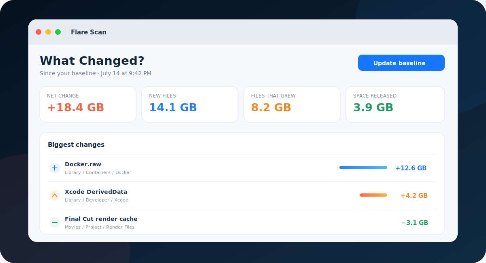
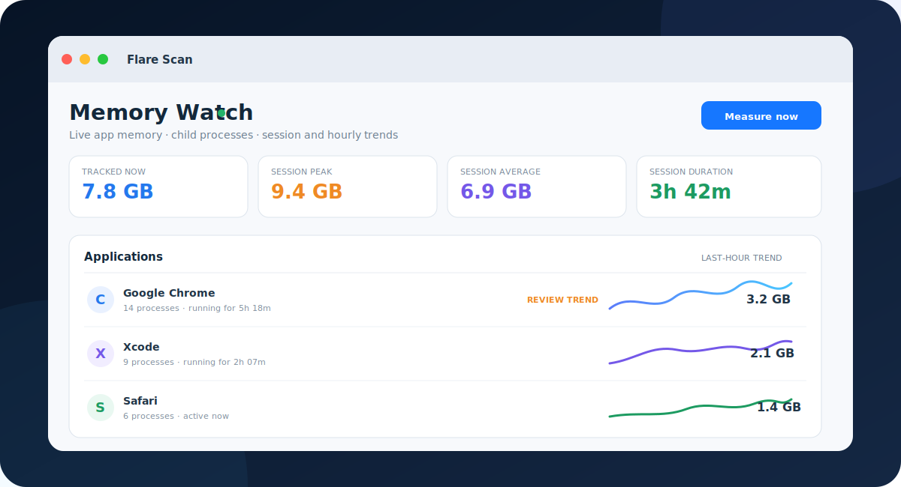

<p align="center">
  
</p>

<h1 align="center">Flare Scan</h1>

<p align="center">
  <b>See what uses disk and memory — and what changed.</b><br>
  A private, native, open-source system insight tool for macOS.
</p>

<p align="center">
  
  
  
  
  <a href="LICENSE"></a>
</p>

<p align="center">
  <a href="dist/Flare%20Scan.dmg"><b>Download DMG</b></a>
  ·
  <a href="#build-from-source"><b>Build from source</b></a>
  ·
  <a href="#privacy-by-design"><b>Privacy model</b></a>
</p>

<p align="center"></p>

Most utilities show either disk usage or one instant of memory use. Flare Scan
connects both: **what occupies your storage, what changed since the last scan,
and which apps have been consuming memory throughout your work session?**

Choose a folder or volume, inspect its real allocated space as an interactive
Sunburst or Treemap, save an opt-in local baseline, and return later to see the
files that appeared, grew, shrank, or disappeared. Find exact duplicates and
old large files, export the evidence, reveal anything in Finder, or move a
carefully verified item to macOS Trash.

Leave the lightweight **Memory Watch** running from the menu bar to track app
footprints, child processes, session peaks and averages, last-hour trends, and
approximate foreground time. Flare Scan can request a normal app quit after
confirmation; it never force-kills a process or quits anything automatically.

No account. No telemetry. No cloud. No third-party runtime dependencies.

## The feature that changes the workflow

<p align="center"></p>

### What Changed?

Take a local baseline after a scan. The next time you scan the same location,
Flare Scan calculates:

- **Net storage change** across the selected root.
- **New files** that crossed the tracked-size threshold.
- **Files that grew**, ranked by their byte difference.
- **Released space** from files that shrank or disappeared.
- **The 100 biggest changes**, with Finder actions for items still on disk.

Baselines are deliberately opt-in and local. Flare Scan stores only comparison
metadata—timestamps, size totals, thresholds, and relative paths plus sizes for
files of at least 1 MB—capped at the 50,000 largest entries.
The selected root is represented on disk by a SHA-256-derived identity rather
than a readable absolute path in the snapshot filename. You can replace or
forget a baseline at any time.

## Memory Watch

<p align="center"></p>

Memory Watch samples normal macOS GUI apps once per minute by default and rolls
observable child processes into each app's footprint. Switch to 15 seconds or
five minutes when you need a different balance.

- **Current resident memory**, process count, and change since the prior sample.
- **Session peak and average** from the moment Flare Scan launched.
- **Last-hour peak, average, and sparkline** for every observed app.
- **Current app uptime** plus approximate foreground time observed by the monitor.
- **Session history** that retains apps after they close, without writing it to disk.
- **Menu-bar mode** that remains useful after the main window closes.
- **Review hints** for unusually high or fast-growing memory — never a claim
  that high usage alone is a bug.
- **Normal Quit** behind an explicit confirmation. Protected system apps such
  as Finder are never offered as quit targets.

Memory Watch reads only app identity, process relationships, launch state, and
resident-memory totals. It does not inspect window titles, documents, typed
text, browser history, or process memory contents.

## One place to understand your Mac

| Capability | What you get |
|---|---|
| **Memory Watch** | Track current, session, and last-hour app memory from the main window or menu bar. |
| **Storage timeline** | Compare a new scan against your saved local baseline. |
| **Sunburst** | See hierarchy and expensive branches in one interactive radial map. |
| **Treemap** | Compare the largest neighboring items with maximum screen efficiency. |
| **Exact duplicates** | SHA-256 confirms byte-for-byte matches; names are never treated as proof. |
| **Old large files** | Review files larger than 100 MB and untouched for at least 180 days. |
| **Storage categories** | Understand usage across video, images, audio, archives, documents, code, installers, and more. |
| **Largest files** | Rank the top 50 files across the entire scanned tree. |
| **Safe cleanup** | Reveal in Finder or move a verified item to macOS Trash after explicit confirmation. |
| **JSON + CSV reports** | Export categories, findings, duplicate groups, scan issues, and timeline changes. |
| **Scan diagnostics** | See exactly when macOS denied access instead of trusting a silently incomplete total. |

### Built differently

| | Flare Scan |
|---|---|
| Where analysis runs | Entirely on your Mac |
| Network behavior | No networking code, updater, analytics SDK, or remote configuration |
| Telemetry and accounts | None |
| Runtime dependencies | Zero |
| Memory monitoring | Read-only process metadata; no privileged helper or administrator access |
| Duplicate detection | Local, chunked SHA-256 hashing of same-size candidates |
| Cleanup behavior | Recoverable macOS Trash operation, never silent permanent deletion |
| Filesystem scope | A location you explicitly choose in the native macOS picker |
| Source | Auditable Swift and SwiftUI under the MIT license |

## A 30-second workflow

1. Open **Memory Watch** for immediate app-memory trends, or click **Choose
   Folder or Volume** for storage analysis.
2. Explore the result in **Sunburst**, **Treemap**, or **Insights**.
3. Open **What Changed?** and save a baseline if you want a future comparison.
4. Run duplicate analysis or review old and large files.
5. Reveal a finding in Finder, export JSON/CSV, or verify it before moving it to
   Trash.
6. Scan the same location later to see exactly where storage grew or was freed.
7. Close the main window when you are done; the compact menu-bar monitor can
   continue sampling until you pause it or quit Flare Scan.

Scanning and hashing run away from the main actor, publish bounded progress,
and can be cancelled. Symbolic links are treated as leaves, so Flare Scan does
not follow cycles or count linked trees twice.

## Install

### Download the community build

1. Download [`Flare Scan.dmg`](dist/Flare%20Scan.dmg).
2. Open it and drag **Flare Scan.app** into `Applications`.
3. The checked-in community build is ad-hoc signed and not Apple-notarized. On
   first launch, use **right-click → Open → Open**.

> Install artifacts only from this repository, or build the app yourself. Flare
> Scan has no auto-updater and never downloads executable code.

The release uses standard macOS user permissions. It is intentionally not an
App Sandbox build because macOS returns zero for other apps' resident-memory
metrics inside that sandbox. Flare Scan uses no privileged helper and never
requests administrator access.

### Requirements

- macOS 14 Sonoma or newer
- Apple Silicon for the checked-in artifact; source builds target the host Mac
- Xcode command-line tools and Swift 6 only when building from source

## Storage Insights

- **Largest files** ranks the top 50 files across the full selected tree, not
  just the folder currently visible in the visualization.
- **Categories** summarizes allocated bytes and file counts by useful media and
  document types.
- **Duplicate Finder** groups files by logical size before hashing. Only
  candidates larger than 1 MB are read, and a result appears only after SHA-256
  confirms identical content. Files are processed in 1 MB chunks.
- **Old large files** surfaces review candidates; age alone is never presented
  as proof that a file is safe to remove.
- **Scan completeness** reports unreadable paths and retains a bounded error
  sample so incomplete scans remain visible.
- **JSON and CSV export** produces a versioned local report with summary data,
  categories, largest and old files, duplicates, scan diagnostics, and storage
  history when a comparison exists.

Exports contain local paths by design. Review them before sharing publicly.

## Safe deletion model

Flare Scan never calls a permanent unlink/remove API for cleanup. It uses
`FileManager.trashItem`, which sends the chosen item to macOS Trash when the
volume supports it.

Before any disk mutation, every check below must pass:

1. The target belongs to the current in-memory scan tree.
2. Its parent chain resolves to the selected scan root.
3. Its standardized path is strictly inside that root.
4. The target is not the scan root itself.
5. The target still exists on disk.
6. You approve a destructive confirmation showing the full path, type, and
   scanned size.

If validation or Trash fails, the visualization is not modified and the error
is shown. After a successful move, the current tree and storage comparison are
updated. Rescan to reconcile filesystem changes made by other apps.

> Confirmation protects against accidental clicks, not incorrect human
> judgment. Read the complete path and keep backups of irreplaceable data.

## Privacy by design

| Control | Guarantee |
|---|---|
| **No telemetry** | No analytics, tracking, login, crash-reporting SDK, or remote configuration. |
| **No networking code** | No updater, upload path, cloud client, or third-party SDK is included. |
| **Memory data stays ephemeral** | Memory Watch keeps app names and numeric samples in RAM only; the session disappears on quit. |
| **No privileged helper** | Process metrics use read-only standard-user APIs without administrator access. |
| **Explicit scan scope** | Storage analysis starts only after you choose a folder or volume in the native picker. |
| **Local baselines** | Opt-in relative paths and sizes stay in Application Support and can be forgotten in one click. |
| **Local hashing** | File hashes and contents never leave the Mac. |
| **Explicit exports** | A report exists only after you choose a destination in the native save panel. |
| **No symlink traversal** | Symbolic links are never followed. |
| **Recoverable cleanup** | Flare Scan requests a move to macOS Trash instead of permanent deletion. |

The release is not sandboxed because cross-process memory totals are unavailable
to App Sandbox applications. That tradeoff is explicit: storage actions still
require a chosen scan root, containment validation, and confirmation; Memory
Watch is read-only except for a user-approved normal Quit request. macOS may
still deny protected filesystem locations, and Flare Scan records those errors
instead of attempting to bypass system privacy controls.

## Build from source

```bash
git clone https://github.com/umudhasanli/flare-scan.git
cd flare-scan

# Development
swift build
swift run

# Tests — warnings are treated as errors
swift test -Xswiftc -warnings-as-errors

# Ad-hoc-signed release bundle
./scripts/build-app.sh

# Drag-to-Applications disk image
./scripts/make-dmg.sh
```

Build outputs:

```text
dist/Flare Scan.app
dist/Flare Scan.dmg
```

The release script embeds the SVG logo, generates a native `.icns` icon,
creates `Info.plist`, applies an ad-hoc signature, and verifies the bundle. It
does not add privileged entitlements.

### Developer ID distribution

The community artifact is intentionally transparent about not being notarized.
Maintainers with an Apple Developer ID can sign, submit, and staple a public
release:

```bash
codesign --force --options runtime \
  --sign "Developer ID Application: Your Name (TEAMID)" \
  "dist/Flare Scan.app"

xcrun notarytool submit "dist/Flare Scan.dmg" \
  --keychain-profile "profile-name" --wait
xcrun stapler staple "dist/Flare Scan.dmg"
```

## Architecture

```text
Native folder picker
        │ defines the explicit storage-analysis scope
        ▼
Scanner (background) ──► FileNode tree (allocated + logical size)
        │                         │
        │ progress + issues       ├──► Sunburst / Treemap
        ▼                         ├──► categories / largest / old files
AppState ◄────────────────────────┼──► opt-in SHA-256 duplicates
        │                         └──► JSON / CSV reports
        │
        ├──► local snapshot ──► next scan ──► What Changed? delta
        │
        └── confirmed target ──► containment checks ──► macOS Trash

NSWorkspace apps ──► read-only process sampler ──► session/hourly reducer
                                                    │
                                                    ├──► Memory Watch window
                                                    └──► compact menu-bar view
```

`AppState` owns scan lifecycle, navigation, comparison state, exports, and
deletion validation. `Scanner` traverses in a detached task. `FileNode` models
the result tree. `ScanInsights` creates bounded summaries. `ScanSnapshot` and
`ScanDelta` power private local history. `DuplicateFinder` performs cancellable,
chunked hashing. SwiftUI Canvas views render precomputed Sunburst and Treemap
layouts. `MemorySampler` attributes observable child processes to GUI apps;
`MemorySession` maintains bounded in-memory totals and rolling trends.

## Project structure

```text
flare-scan/
├── Package.swift
├── assets/                     # logo and GitHub presentation artwork
├── scripts/
│   ├── build-app.sh            # bundle, sign, and verify the app
│   └── make-dmg.sh             # create the install DMG
├── Sources/FlareScan/
│   ├── Models/                 # scanner, insights, history, reports, memory
│   ├── ViewModel/              # app lifecycle and safety validation
│   ├── Layout/                 # Sunburst and Treemap algorithms
│   ├── Views/                  # SwiftUI interface
│   ├── Util/                   # formatting and palette
│   └── Resources/              # bundled logo
└── Tests/FlareScanTests/       # scanner-independent correctness tests
```

## Honest limitations

- The checked-in DMG is ad-hoc signed, not Apple-notarized.
- The release is intentionally not App Sandbox-enabled so Memory Watch can read
  other apps' resident-memory totals. It has standard user permissions and no
  privileged helper.
- Resident memory is point-in-time data and can differ from Activity Monitor
  because macOS dynamically compresses and shares memory.
- Child-process attribution follows process ancestry. Independently launched
  XPC services may not be included in an app's total.
- Memory history is session-only and is not restored after Flare Scan quits.
- A scan is a point-in-time view; changes made by other apps require a rescan.
- Protected paths macOS refuses to expose cannot contribute to totals. Insights
  reports the skipped count and up to 100 examples.
- History tracks files of at least 1 MB and keeps at most the 50,000 largest
  entries. When a snapshot is capped, Flare Scan avoids claiming that an absent
  entry was added or removed.
- The details panel displays at most the 300 largest direct children.
- Duplicate analysis ignores files smaller than 1 MB to avoid expensive,
  low-value hashing.
- “Old” means not modified in 180 days; it does not mean unused or safe to
  remove.
- Trash behavior can differ for external and network volumes. Failures are
  reported without removing the item from the visualization.

## Roadmap

- Signed and notarized release artifacts
- User-configurable history and duplicate thresholds
- Ignore rules for developer caches and generated folders
- Side-by-side category trends across multiple baselines
- Optional memory-pressure notifications and configurable review thresholds
- Additional accessibility passes

Have an idea that would make storage investigation safer or faster? Open an
[issue](https://github.com/umudhasanli/flare-scan/issues).

## Troubleshooting

<details>
<summary><b>A protected folder is missing or smaller than expected</b></summary>

macOS privacy controls may deny access. Select a narrower folder or review Files
& Folders permissions in System Settings. Flare Scan does not bypass them.
</details>

<details>
<summary><b>The Trash operation failed</b></summary>

Confirm the item still exists, the volume is writable, and Trash is available
on that volume. Rescan if another app moved the item.
</details>

<details>
<summary><b>macOS blocks the first launch</b></summary>

Use right-click → Open for the current non-notarized build, or build from source.
</details>

## Contributing

Issues and pull requests are welcome. Preserve the safety invariants: keep disk
mutations inside the selected scan root, protect that root, require deliberate
confirmation, use normal app termination, and prefer recoverable macOS
operations. Before submitting:

```bash
swift test -Xswiftc -warnings-as-errors
bash -n scripts/build-app.sh scripts/make-dmg.sh
```

## License

MIT — see [LICENSE](LICENSE). © 2026 Umud Hasanli.
