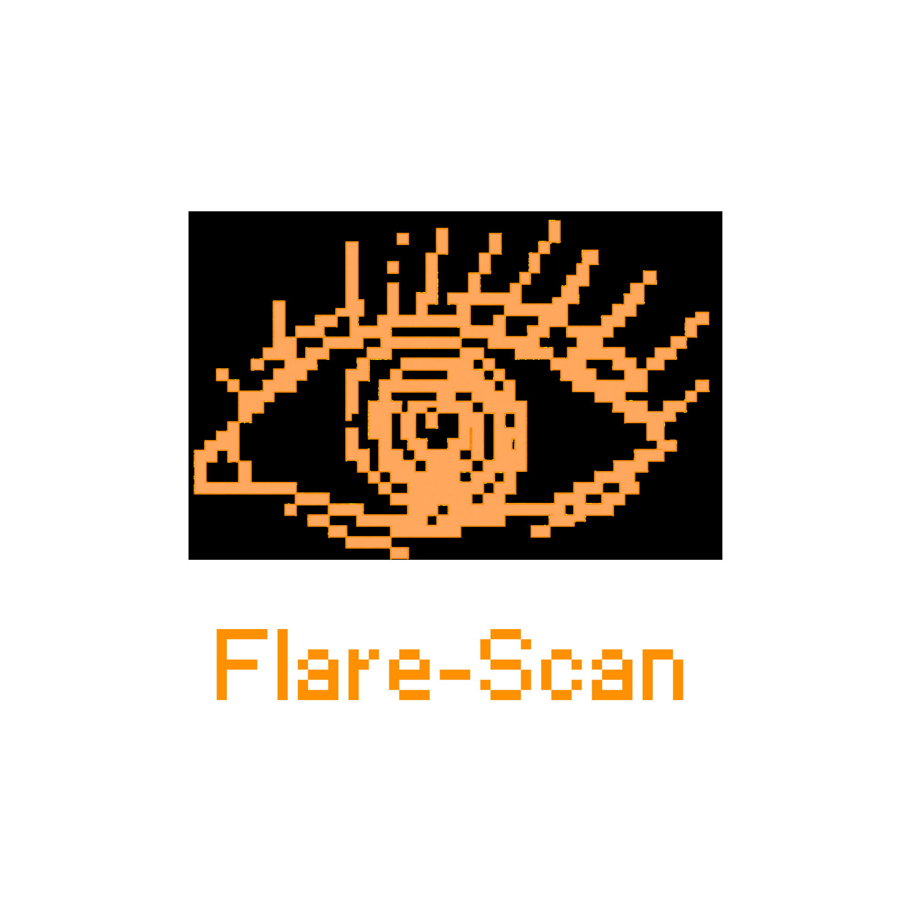
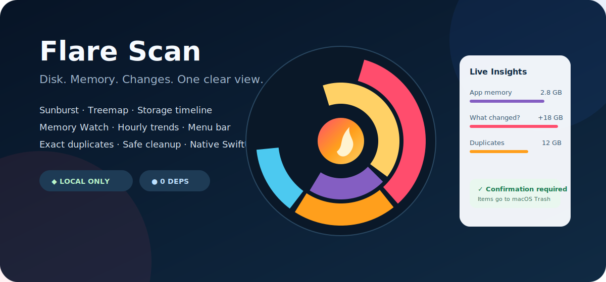

<p align="center">
  
</p>

<h1 align="center">Flare Scan</h1>

<p align="center"><b>Disk space, made visible — a private, native disk space analyzer for macOS.</b></p>

<p align="center">
  
  
  
  
  <a href="LICENSE"></a>
</p>

<p align="center"></p>

**Flare Scan is an open-source macOS disk space analyzer, storage visualizer,
and safe disk cleanup utility built with SwiftUI.** It shows exactly what
consumes your Mac's storage. Choose a folder or
volume and explore it as an interactive **Sunburst** or **Treemap**. Hover for
the full path and allocated size, click to drill down, and use breadcrumbs to
move back through the hierarchy.

When you find something you no longer need, Flare Scan can move that exact item
to the macOS Trash — only after showing its full path, type, and size in a
destructive confirmation dialog. The selected scan root itself is protected.

| | | |
|---|---|---|
| 🌞 **Sunburst** — understand nested folders at a glance | 🧱 **Treemap** — compare large items immediately | 🗑️ **Recoverable cleanup** — confirmed moves to Trash |
| 🔒 **App Sandbox** — access stays inside your selection | 📴 **Fully offline** — no network entitlement | ⚡ **Native SwiftUI** — responsive and dependency-free |

## Contents

- [Why Flare Scan](#why-flare-scan)
- [Install](#install)
- [Use it](#use-it)
- [Safe deletion model](#safe-deletion-model)
- [Privacy and security](#privacy-and-security)
- [Build from source](#build-from-source)
- [Architecture](#architecture)
- [Project structure](#project-structure)
- [Known limitations](#known-limitations)
- [Troubleshooting](#troubleshooting)
- [Contributing](#contributing)

## Why Flare Scan

Storage settings tell you broad categories. Finder makes you inspect folders one
at a time. Flare Scan builds one navigable picture from the real allocated sizes
on disk, so the expensive branches stand out immediately.

- **Allocated size first.** Reports the space a file occupies on disk, falling
  back to logical size when macOS does not expose allocation data.
- **Two complementary views.** Sunburst exposes hierarchy; Treemap maximizes
  side-by-side size comparison.
- **Background scanning.** Traversal runs away from the main actor and publishes
  throttled progress, keeping the interface responsive.
- **No hidden services.** No analytics, accounts, cloud sync, ads, or third-party
  packages.
- **Symlink safe.** Symbolic links are never followed, preventing cycles and
  double-counting.

If you are looking for a native DaisyDisk alternative, visual disk usage tool,
large-file finder, storage analyzer, Treemap viewer, or open-source Mac disk
cleaner, Flare Scan keeps the workflow local and transparent.

## Install

### Download the DMG

1. Download [`Flare Scan.dmg`](dist/Flare%20Scan.dmg).
2. Open it and drag **Flare Scan.app** into `Applications`.
3. Because the current community build is not Apple-notarized, first launch it
   with **right-click → Open → Open**.

> Only install artifacts from this repository or build the app yourself. The
> source contains no auto-updater and the app never downloads executable code.

### Requirements

- macOS 14 Sonoma or newer
- Apple Silicon or the architecture on which you build the current artifact
- Xcode / Swift 6 only when building from source

## Use it

1. Click **Qovluq və ya Disk Seç**.
2. Select one folder or volume in the macOS picker. This explicit choice defines
   the app's sandbox boundary.
3. Wait for scanning to finish or cancel at any time.
4. Switch between **Sunburst** and **Treemap**.
5. Hover over a region to see its path and size; click a directory to drill in.
6. Use the breadcrumb or up-arrow to navigate back.
7. To clean up an item, click its red Trash button and carefully verify the
   confirmation dialog before approving.

## Safe deletion model

Deletion is intentionally conservative. Flare Scan does **not** call a permanent
unlink/remove API. It uses the native `FileManager.trashItem` operation, so a
successfully removed item appears in macOS Trash and can normally be restored.

Before any disk mutation, all of these checks must pass:

1. A scan must still be active for the selected root.
2. The target must be a real node in the currently displayed scan tree.
3. Walking through its parents must lead to the current scan root.
4. Its standardized path must be strictly inside the selected root.
5. The target must not be the selected root itself.
6. The target must still exist on disk.
7. The user must press the destructive confirmation button after seeing the
   exact full path, item type, and scanned size.

If validation or the Trash operation fails, the in-memory visualization is not
modified and an error is shown. After success, the item and its size are removed
from the current visualization. You can rescan to reconcile changes made by
other apps.

> **Important:** confirmation protects against accidental clicks, not incorrect
> human judgment. Always read the complete path. Moving a folder to Trash also
> moves everything inside it. Keep backups of irreplaceable data.

## Privacy and security

| Control | What it means |
|---|---|
| **App Sandbox** | macOS confines filesystem access to locations the user explicitly selects. |
| **User-selected read/write** | Write permission is required solely for confirmed Trash operations; it is not global disk access. |
| **No network entitlement** | The sandboxed app cannot initiate network connections. Scan data stays on the Mac. |
| **No telemetry** | There is no analytics, crash-reporting SDK, login, tracking, or remote configuration. |
| **Zero dependencies** | Runtime code uses only Apple SwiftUI, AppKit, and Foundation APIs. |
| **No symlink traversal** | Scanner treats symbolic links as leaves and never follows them. |
| **Recoverable cleanup** | Items are moved to macOS Trash, not permanently erased by Flare Scan. |

The exact sandbox policy is readable in
[`packaging/DiskLens.entitlements`](packaging/DiskLens.entitlements). macOS may
still deny protected locations, and Flare Scan treats those errors as inaccessible
rather than trying to bypass system privacy controls.

## Build from source

```bash
git clone https://github.com/umudhasanli/flare-scan.git
cd flare-scan

# Development build / run
swift build
swift run

# Release .app with ad-hoc signature and sandbox entitlements
./scripts/build-app.sh

# Drag-to-Applications disk image
./scripts/make-dmg.sh
```

Outputs:

```text
dist/Flare Scan.app
dist/Flare Scan.dmg
```

The included build script embeds the official Flare Scan SVG logo, generates a
native `.icns` app icon, creates `Info.plist`,
applies the sandbox entitlements, ad-hoc signs the bundle, and verifies both the
signature and sandbox flag.

### Distribution signing and notarization

Public releases without the first-launch warning require an Apple Developer ID:

```bash
codesign --force --options runtime \
  --entitlements packaging/DiskLens.entitlements \
  --sign "Developer ID Application: Your Name (TEAMID)" \
  "dist/Flare Scan.app"

xcrun notarytool submit "dist/Flare Scan.dmg" \
  --keychain-profile "profile-name" --wait
xcrun stapler staple "dist/Flare Scan.dmg"
```

## Architecture

```text
NSOpenPanel selection
        │ grants a security-scoped sandbox location
        ▼
Scanner (background task) ──► FileNode tree (allocated sizes)
        │                              │
        │ progress                     ├──► Sunburst layout
        ▼                              └──► Treemap layout
AppState (main actor) ◄──── hover / drill / breadcrumb / rescan
        │
        └── confirmed target ──► containment checks ──► macOS Trash
```

`AppState` owns scan lifecycle, navigation, progress, and deletion validation.
`Scanner` performs synchronous recursive traversal inside a detached task.
`FileNode` represents one immutable identity with mutable aggregate size and
children. SwiftUI Canvas views render precomputed layouts and report hit tests
back to the main actor.

## Project structure

```text
flare-scan/
├── Package.swift
├── assets/
│   ├── flare-scan-logo-v2.svg  # project/application logo
│   └── hero.svg                # GitHub presentation graphic
├── packaging/
│   └── DiskLens.entitlements   # macOS sandbox policy
├── scripts/
│   ├── build-app.sh            # release build, bundle, sign, verify
│   └── make-dmg.sh             # drag-to-Applications DMG
└── Sources/DiskLens/
    ├── DiskLensApp.swift
    ├── Models/                 # tree and filesystem scanner
    ├── ViewModel/              # app state and safety validation
    ├── Layout/                 # Sunburst and Treemap algorithms
    ├── Views/                  # SwiftUI interface
    ├── Util/                   # formatting and palette
    └── Resources/              # bundled logo
```

## Known limitations

- The checked-in DMG is ad-hoc signed, not Apple-notarized.
- Results are a point-in-time snapshot; changes by Finder or other apps require
  a rescan.
- Directories macOS refuses to expose are skipped and therefore contribute no
  size to the result.
- The details panel currently lists the largest 300 direct children.
- Trash availability and behavior can differ for external or network volumes;
  failures are reported and nothing is removed from the visualization.

## Troubleshooting

**A protected folder is missing or shows less space than expected.**

macOS privacy controls may deny access. Select a narrower folder, or review the
app's Files & Folders permissions in System Settings. Flare Scan does not bypass
these controls.

**The Trash operation failed.**

Confirm that the item still exists, the volume is writable, and Trash is
available on that volume. Rescan if another app moved the item.

**The app is blocked on first launch.**

Use right-click → Open for the current non-notarized build, or build from source.

## Contributing

Issues and pull requests are welcome. For filesystem changes, keep the safety
invariants explicit: remain inside the user-selected sandbox location, protect
the scan root, require deliberate confirmation, and prefer recoverable macOS
operations. Run `swift build` and both packaging scripts before submitting.

## License

MIT — see [LICENSE](LICENSE). © 2026 Umud Hasanli.
